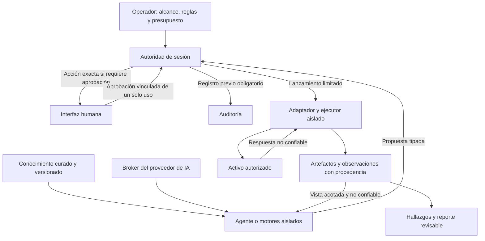

# Recon Cockpit — agentes de pentesting con ejecución controlada

**Borrador de propuesta · 16 de septiembre de 2026 · No presentado**

Concurso de Desarrollo de Soluciones de Ciberseguridad 2026–2027,
Facultad de Ingeniería, Universidad de Palermo.

## 1. Desafío seleccionado y problema

La propuesta se encuadra en el **Desafío 4: Seguridad de agentes inteligentes
autónomos**, orientado al control, aislamiento y trazabilidad de sus acciones.
[Convocatoria oficial](https://www.palermo.edu/ingenieria/concurso-ciberseguridad/).

El caso de aplicación es la realización de pruebas de penetración autorizadas
con uno o más agentes de inteligencia artificial. Un pentest requiere descubrir
servicios, relacionar evidencias, formular hipótesis, seleccionar técnicas,
validar resultados y comunicar hallazgos. Los agentes pueden realizar partes de
ese trabajo, pero también interpretar contenido malicioso como órdenes, elegir
un destino incorrecto, abusar de una herramienta o presentar una conjetura como
una vulnerabilidad confirmada.

El problema es permitir trabajo útil sin entregar al agente el control de
permisos, alcance, credenciales, aprobaciones ni registros de ejecución.
Una instrucción en el prompt no equivale a una restricción aplicada por el
sistema operativo.

## 2. Solución y visión de producto

Recon Cockpit será una plataforma de pentesting asistido por agentes, con motores
especializados y flujos basados en evidencia. Está dirigida inicialmente a
profesionales y estudiantes que operan en laboratorios propios o entornos con
autorización expresa. El operador define activos, actividades, límites y
condiciones de aprobación de cada evaluación.

Los agentes proponen acciones estructuradas. Un plano de autoridad independiente
evalúa cada propuesta. Adaptadores de herramientas transforman únicamente
capacidades admitidas en ejecuciones aisladas y limitadas. Cada observación y
hallazgo debe relacionarse con la ejecución que lo produjo, distinguiendo
evidencia, interpretación y revisión humana.

La visión de largo plazo comprende reconocimiento, enumeración, validación de
vulnerabilidades, explotación expresamente habilitada, evaluación posterior al
acceso, limpieza y reporte. Cada familia requerirá capacidades, políticas,
aislamiento y pruebas propios. Autorizar una fase no autoriza las siguientes.

## 3. Arquitectura propuesta

El esquema representa la arquitectura objetivo. La sección 4 distingue lo
implementado de lo pendiente.

| Componente | Responsabilidad y límite |
| --- | --- |
| Operador e interfaz humana | Fijar alcance, modo y límites; aprobar la acción exacta cuando corresponda. |
| Agente/coordinador y motores | Elegir próximos pasos e hipótesis; sin permisos para modificar política ni lanzar herramientas directamente. |
| Autoridad de sesión | Validar esquema, alcance, secuencia, presupuestos y aprobación en cada acción; detener ante fallos. |
| Catálogo y adaptadores | Definir parámetros, efectos, recursos, resultados y aislamiento por herramienta; sin shell genérico. |
| Ejecutores | Revalidar el lanzamiento y aplicar restricciones de red, archivos, procesos, tiempo y salida. |
| Broker del proveedor | Mediar solicitudes, datos, credenciales y consumo; no conceder autoridad sobre herramientas. |
| Evidencia y reporte | Conservar procedencia; no convertir una respuesta del modelo en prueba de éxito. |
| Auditoría | Registrar intención antes de ejecutar; incorporar posteriormente almacenamiento con controles independientes. |

Las comunicaciones entre procesos utilizan contratos explícitos y mensajes
acotados. Futuros agentes especializados compartirán límites de evaluación
impuestos externamente: delegar no ampliará el alcance. Las páginas consultadas,
salidas de herramientas y mensajes de otros agentes seguirán siendo datos no
confiables.

## 4. Estado real del desarrollo

La base previa, [PR #5](https://github.com/0xsl0th/recon-cockpit/pull/5),
se integró en `main` como `bf3a359`. Al 16 de septiembre de 2026, R1 aporta la
integración offline con la autoridad en `cfde4ed`, correspondiente al
[PR #6 en borrador](https://github.com/0xsl0th/recon-cockpit/pull/6). La rama
`feature/secure-agent-http-assessment` implementa encima la primera evaluación
HTTP con evidencia y reporte. Su publicación y las comprobaciones alojadas se
registran por separado en [continue-here.md](continue-here.md).

| Implementado y verificado | Pendiente |
| --- | --- |
| Acciones HTTP tipadas, política restrictiva, aprobación caducable de un solo uso, auditoría previa y descriptor versionado de la capacidad. | Catálogo general y adaptadores adicionales. |
| Sesiones simuladas limitadas y un flujo HTTP determinista cuyo siguiente paso depende de evidencia real del fixture. | Descubrimiento aislado y motores adicionales. |
| Coordinador aislado en Linux, autoridad externa y ejecutores de fixtures con IPC acotado. | Separar más responsabilidades del proceso confiable del host. |
| Parser y broker con respuestas sintéticas, presupuestos reservados e integración R1 con coordinador/autoridad. | Transporte real, credenciales y gasto. |
| Sonda HTTP y backend separado para un IPv4/puerto autorizado, probado en una red propia. | Nmap en modo seguro, sesiones remotas, pruebas VPN y herramientas autenticadas. |
| Artefactos privados, observaciones vinculadas, reportes JSON/Markdown y detección de evidencia incompleta mediante inspección de solo lectura. | Ciclo de revisión más amplio, interfaz y auditoría independiente. |

La validación local de R2 del 16 de septiembre registró **1.849 pruebas
portables** en 16,208 segundos y **78 integraciones reales en Linux** en 151,816
segundos, sin fallos, errores ni pruebas omitidas en las suites seleccionadas.
Los comandos y límites constan en [verification.md](verification.md). El modo
offline conecta broker, parser, coordinador y autoridad; conserva los modos
anteriores como referencias de regresión. El cockpit interactivo utiliza Nmap en
el host; no es un adaptador seguro para agentes y no se conectará directamente
a ellos.

La evaluación R2 realiza hasta dos GET en un servicio propio de un namespace
aislado. El primero descubre un documento de diagnóstico; solo evidencia válida
habilita la segunda consulta a la ruta permitida del mismo caso. Se verificaron
seis variantes: metadatos sintéticos expuestos, ausencia del endpoint, documento
malformado, demora, salida excesiva y descubrimiento hostil. El reporte distingue
condición sembrada validada, no demostrada en ese endpoint e inconclusa. Conserva
referencias a ejecuciones y artefactos; todo hallazgo queda pendiente de revisión
del operador. No se afirma una vulnerabilidad general, un bypass de autenticación
ni la autenticidad del contenido del servidor. Véase [el contrato R2](http-assessment.md).

No se han validado modelos autónomos ni enviado solicitudes a una API real.
La autoridad, interfaz humana, auditoría y lanzador aún comparten un proceso
confiable. El aislamiento actual no demuestra resistencia al compromiso de ese
proceso o del kernel. El propietario puede modificar los registros locales.
Estos límites forman parte explícita de la evaluación.

## 5. Motores y conocimiento de pentesting

Un motor combina reglas de selección, conocimiento de una especialidad y
contratos de herramientas. Puede utilizar un modelo sin convertirse en
autoridad. Los procedimientos se convertirán en fichas revisadas: precondiciones,
evidencia necesaria, capacidades permitidas, criterios de éxito, límites,
condiciones de detención y obligaciones de limpieza.

Las fuentes indicadas por el titular incluyen el
[manual de Enrique Folte](https://enriquefolte.com/),
[PentestMonkey](https://pentestmonkey.net/),
[PayloadsAllTheThings](https://github.com/swisskyrepo/PayloadsAllTheThings),
[GTFOBins](https://gtfobins.org/),
[LOLBAS](https://lolbas-project.github.io/),
[HackTricks](https://book.hacktricks.wiki/en/index.html) y
[Hack The Box](https://www.hackthebox.com/).
Se utilizarán como referencias atribuidas y, cuando corresponda, entornos de
aprendizaje; no se supone una afiliación con sus autores.

Las categorías de evolución comprenden enumeración, aplicaciones web, Active
Directory, escalada de privilegios Linux/Windows, payloads y reverse shells,
post-explotación y laboratorios/CTF. Su inclusión en el conocimiento no habilita
su ejecución. Cada técnica debe traducirse a una capacidad revisada y cumplir
su política específica. Cada ficha conservará fuente, versión, atribución,
revisión y casos de prueba; no se ejecutarán comandos extraídos directamente
de páginas.

La secuencia comienza por descubrimiento y enumeración HTTP, validación acotada
y reporte. Los demás motores y la coordinación de varios agentes se incorporarán
después de demostrar un flujo útil y verificable con un único agente.

## 6. Aporte, demostrador y validación

El aporte a evaluar es la integración entre razonamiento de agentes, flujos de
pentesting y autoridad externa: trabajo útil dentro de límites aplicados, con
procedencia y fallos observables. Se usan mecanismos existentes de Linux; no se
afirma haber inventado el aislamiento ni demostrado novedad académica frente a
todo el estado del arte.

El demostrador previsto realizará una evaluación acotada en un laboratorio
propio: descubrir servicios, seleccionar enumeración pertinente, validar una
condición sembrada y producir un hallazgo con evidencia y revisión. El mismo
escenario incluirá respuestas manipuladas que intenten ampliar alcance,
falsificar aprobaciones o inventar resultados. Se comparará una línea base
determinista con un agente real cuando su integración esté habilitada.

El primer tramo HTTP y su reporte ya funcionan con planificación determinista y
respuestas sintéticas del proveedor. El siguiente tramo es R3: diseñar e
implementar el menor adaptador de descubrimiento que preserve el aislamiento.
La evaluación con un modelo real continúa pendiente.

| Dimensión | Evidencia a obtener |
| --- | --- |
| Utilidad | Cobertura de condiciones sembradas, precisión de hallazgos y pasos necesarios; distinguir desconocido de descartado. |
| Control | Cero ejecuciones no autorizadas en los casos de prueba, contrastadas con testigos propios de red y archivos. |
| Procedencia | Todo hallazgo confirmado enlaza ejecuciones y artefactos suficientes; las afirmaciones sin prueba siguen siendo hipótesis. |
| Robustez | Evaluar inyección en resultados y conocimiento, replay, salida excesiva, cancelación y fallos de auditoría. |
| Reproducibilidad | Registrar configuración, versiones, escenario, modelo, repeticiones y variabilidad; informar fallos y pruebas omitidas. |
| Recursos | Medir tiempo y llamadas; evaluar gasto real cuando exista un proveedor habilitado. |

El mínimo del concurso será un flujo útil de extremo a extremo. No se promete
un pentester autónomo universal, inmunidad a toda prompt injection ni todos los
motores futuros. Explotación general, AD, múltiples agentes y pruebas VPN son
extensiones, no dependencias de ese mínimo.

## 7. Cronograma y entregables

La convocatoria fija el **15 de noviembre de 2026** para presentar el proyecto y
el **20 de mayo de 2027** para la entrega final. Solicita desafío, arquitectura e
integrantes al inscribirse; para la etapa final, una solución funcional con
validación, demostración y documentación. Los finalistas presentan en H4ck3d 2027.
[Fuente oficial, consultada el 15/09/2026](https://www.palermo.edu/ingenieria/concurso-ciberseguridad/).

| Período propuesto | Entregable |
| --- | --- |
| Septiembre–octubre 2026 | Revisar R1/R2, publicados como PRs en borrador; diseñar e iniciar descubrimiento aislado R3. |
| Hasta el 8/11/2026 | Cerrar propuesta, integrantes, arquitectura, alcance mínimo y evidencia para revisión. |
| 9–15/11/2026 | Presentación por el equipo, con margen respecto de la fecha oficial. |
| Noviembre 2026–enero 2027 | Reconocimiento y validación acotados en laboratorio, con reporte. |
| Enero–febrero 2027 | Modelo real con mediación de credenciales, datos y gasto; habilitación explícita requerida. |
| Marzo–abril 2027 | Evaluación adversarial y funcional, comparación con baseline y documentación. |
| Mayo 2027 | Congelar alcance, ensayar demostración y entregar antes del 20/05. |

Son objetivos sujetos a capacidad del equipo y resultados. El
[roadmap](roadmap.md) define dependencias, aceptación y recortes. La presentación
de noviembre no supone que el desarrollo final ya esté completo.

## 8. Integrantes del equipo de trabajo

| Nombre | Participación identificada | Rol para confirmar antes del envío |
| --- | --- | --- |
| Enrique Folte | Titular del proyecto y del sitio de referencia indicado | Responsable técnico propuesto: arquitectura, desarrollo y evaluación. |

Composición final del equipo, roles, afiliación si corresponde y posibles
colaboradores: **pendientes de confirmación**. No se han añadido integrantes
no identificados por el titular.

Antes del envío se revisarán estos datos, el alcance y las evidencias.
Este documento no constituye una inscripción ni un envío a la Universidad.
