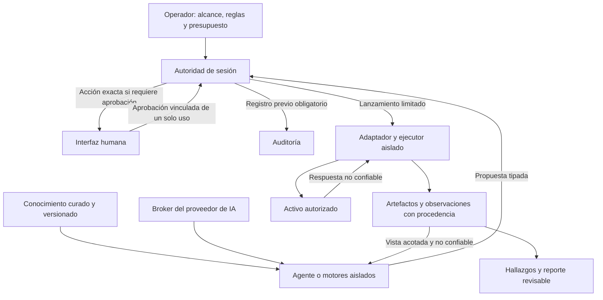

# Recon Cockpit — agentes de pentesting con ejecución controlada

**Borrador de propuesta · 30 de septiembre de 2026 · No presentado**

Concurso de Desarrollo de Soluciones de Ciberseguridad 2026–2027,
Facultad de Ingeniería, Universidad de Palermo.

## 1. Desafío seleccionado y problema

La propuesta se encuadra en el **Desafío 4: Seguridad de agentes inteligentes
autónomos**, orientado al control, aislamiento y trazabilidad de sus acciones.
[Convocatoria oficial](https://www.palermo.edu/ingenieria/concurso-ciberseguridad/).

El caso de aplicación es la realización de pruebas de penetración autorizadas
con uno o más agentes de inteligencia artificial. Un pentest requiere descubrir
servicios, relacionar evidencias, formular hipótesis, seleccionar técnicas,
validar resultados y comunicar hallazgos. Los agentes pueden realizar partes de
ese trabajo, pero también interpretar contenido malicioso como órdenes, elegir
un destino incorrecto, abusar de una herramienta o presentar una conjetura como
una vulnerabilidad confirmada.

El problema es permitir trabajo útil sin entregar al agente el control de
permisos, alcance, credenciales, aprobaciones ni registros de ejecución.
Una instrucción en el prompt no equivale a una restricción aplicada por el
sistema operativo.

## 2. Solución y visión de producto

Recon Cockpit será una plataforma de pentesting asistido por agentes, con motores
especializados y flujos basados en evidencia. Está dirigida inicialmente a
profesionales y estudiantes que operan en laboratorios propios o entornos con
autorización expresa. El operador define activos, actividades, límites y
condiciones de aprobación de cada evaluación.

Los agentes proponen acciones estructuradas. Un plano de autoridad independiente
evalúa cada propuesta. Adaptadores de herramientas transforman únicamente
capacidades admitidas en ejecuciones aisladas y limitadas. Cada observación y
hallazgo debe relacionarse con la ejecución que lo produjo, distinguiendo
evidencia, interpretación y revisión humana.

La visión de largo plazo comprende reconocimiento, enumeración, validación de
vulnerabilidades, explotación expresamente habilitada, evaluación posterior al
acceso, limpieza y reporte. Cada familia requerirá capacidades, políticas,
aislamiento y pruebas propios. Autorizar una fase no autoriza las siguientes.

## 3. Arquitectura propuesta

El esquema representa la arquitectura objetivo. La sección 4 distingue lo
implementado de lo pendiente.

```mermaid
flowchart TD
    O[Operador: alcance, reglas y presupuesto] --> A[Autoridad de sesión]
    K[Conocimiento curado y versionado] --> P[Agente o motores aislados]
    B[Broker del proveedor de IA] --> P
    P -->|Propuesta tipada| A
    A -->|Acción exacta si requiere aprobación| H[Interfaz humana]
    H -->|Aprobación vinculada de un solo uso| A
    A -->|Registro previo obligatorio| L[Auditoría]
    A -->|Lanzamiento limitado| X[Adaptador y ejecutor aislado]
    X --> T[Activo autorizado]
    T -->|Respuesta no confiable| X
    X --> E[Artefactos y observaciones con procedencia]
    E -->|Vista acotada y no confiable| P
    E --> R[Hallazgos y reporte revisable]
```

| Componente | Responsabilidad y límite |
| --- | --- |
| Operador e interfaz humana | Fijar alcance, modo y límites; aprobar la acción exacta cuando corresponda. |
| Agente/coordinador y motores | Elegir próximos pasos e hipótesis; sin permisos para modificar política ni lanzar herramientas directamente. |
| Autoridad de sesión | Validar esquema, alcance, secuencia, presupuestos y aprobación en cada acción; detener ante fallos. |
| Catálogo y adaptadores | Definir parámetros, efectos, recursos, resultados y aislamiento por herramienta; sin shell genérico. |
| Ejecutores | Revalidar el lanzamiento y aplicar restricciones de red, archivos, procesos, tiempo y salida. |
| Broker del proveedor | Mediar solicitudes, datos, credenciales y consumo; no conceder autoridad sobre herramientas. |
| Evidencia y reporte | Conservar procedencia; no convertir una respuesta del modelo en prueba de éxito. |
| Auditoría | Persistir la intención antes de ejecutar y aportar al lanzador una comprobación independiente de ese registro; no conceder permisos. |

Las comunicaciones entre procesos utilizan contratos explícitos y mensajes
acotados. Futuros agentes especializados compartirán límites de evaluación
impuestos externamente: delegar no ampliará el alcance. Las páginas consultadas,
salidas de herramientas y mensajes de otros agentes seguirán siendo datos no
confiables.

## 4. Estado real del desarrollo

Al 30 de septiembre, los alcances acordados de R1–R4 y el alcance offline de R5 están
implementados, verificados e integrados en `main`. R5a/R5b conservan sus contratos
aceptados de aislamiento del proveedor y contabilidad monetaria. La integración
posterior añade aprobación, auditoría y lanzamiento separados, planificación
sintética por TLS propio y una comparación repetida con la línea base.
El operador aceptó el **candidato local offline de R6** después de revisar su
evidencia y realizar el ensayo en una terminal real. La aceptación con un modelo
real y la publicación o presentación del proyecto permanecen pendientes.
El estado de integración y las decisiones constan en
[continue-here.md](continue-here.md); los resultados, límites y revisiones,
en [verification.md](verification.md).

| Implementado y verificado | Límite o trabajo diferido |
| --- | --- |
| Acciones TCP/HTTP tipadas, política restrictiva y flujo TCP → HTTP → diagnóstico con ficha versionada y decisiones respaldadas por evidencia. | Un único procedimiento y destino propio; catálogo general, más herramientas y motores, GUI y API de sesiones siguen diferidos. |
| Ruta optativa con coordinador/parser, escritor de auditoría, aprobación terminal, admisión y lanzador aislados en Linux. El lanzador comprueba directamente el registro durable y la aprobación consumida de la acción exacta. | El host conserva la autoridad de evaluación y la política seleccionada; no se elimina la confianza en los componentes fijos, la terminal o el kernel. |
| Planificación sintética mediante TLS desconectado, liberación explícita de datos y contabilidad con límites jerárquicos; el uso se liquida antes de liberar una propuesta. | Sin proveedor externo ni credencial real. Integración, calidad y facturación de un modelo real requieren autorización posterior. |
| Laboratorio propio persistente durante una evaluación, con ejecutores nuevos por acción e identidad y contadores vinculados a los artefactos. | Cada nueva evaluación crea otra instancia; no hay reanudación, descubrimiento general, sesiones remotas ni pruebas VPN en esta ruta. |
| Reportes JSON/Markdown e inspección independiente de evidencia; dos perfiles de 18 ensayos y paquete local reproducible con fuente fijada. | Los hashes comprueban consistencia local, no autenticidad frente al propietario del host ni exactitud general de un modelo. |
| Ensayo con tres aprobaciones humanas reales y aceptación separada del candidato local, su evidencia y su guía de demostración. | No equivale a aceptar un modelo real ni autoriza publicación, inscripción o envío. |

La ruta integrada usa una [ficha v2](workflow-assessment.md) y un
[laboratorio persistente](owned-lab.md). Intenta una conexión TCP a
`127.0.0.1:8080`, sin datos de aplicación, banners, DNS, reintentos ni barrido.
Solo una conexión válida habilita considerar el primer GET; no prueba identidad
HTTP, permisos ni una vulnerabilidad. Hasta dos GET permiten descubrir y validar
el diagnóstico del mismo caso. Cada acción vuelve a pasar por alcance, aprobación,
presupuesto y ejecución aislada. El servicio propio persiste entre esas acciones;
el lanzador controla su ciclo de vida y el reinicio destruye la instancia anterior.
La inspección posterior no recupera procesos, aprobaciones ni presupuestos.

Los seis casos conservan sus resultados: metadatos sembrados expuestos, endpoint
ausente, documento malformado, demora, salida excesiva y descubrimiento inválido.
Un reporte distingue condición sembrada validada, no demostrada en ese endpoint
e inconclusa. Sus artefactos son resultados decodificados, no capturas exactas del
tráfico HTTP. No se afirma una vulnerabilidad general, un bypass de autenticación
ni autenticidad del contenido remoto. Los modos anteriores se conservan como
referencias de regresión. El cockpit con Nmap ejecutado en el host sigue separado;
no es un adaptador seguro para agentes.

No hubo llamadas pagadas ni solicitudes a proveedores externos. Toda verificación
del proveedor utilizó respuestas y credenciales sintéticas en fixtures propios.
La [planificación TLS integrada](owned-tls-assessment-planning.md), los
[testigos de auditoría](launch-audit-witness.md) y
[aprobación](launch-approval-witness.md) mantienen sus límites explícitos.
El aislamiento no demuestra resistencia al compromiso del propietario, de todos
los componentes confiables o del kernel; el propietario puede alterar registros
locales. No queda un bloqueo necesario de implementación offline en el alcance
aceptado. La validación real sigue pendiente y las ampliaciones opcionales no
reabren los hitos cerrados. Véase el
[orden de cierre](roadmap.md#milestone-completion-order).

## 5. Motores y conocimiento de pentesting

Un motor combina reglas de selección, conocimiento de una especialidad y
contratos de herramientas. Puede utilizar un modelo sin convertirse en
autoridad. La primera ficha revisada ya define precondiciones, evidencia necesaria,
capacidades permitidas, criterios de éxito, límites, condiciones de detención y
limpieza. Ese contrato orientará otros procedimientos si se autoriza su desarrollo.

Las fuentes indicadas por el titular incluyen el
[manual de Enrique Folte](https://enriquefolte.com/),
[PentestMonkey](https://pentestmonkey.net/),
[PayloadsAllTheThings](https://github.com/swisskyrepo/PayloadsAllTheThings),
[GTFOBins](https://gtfobins.org/),
[LOLBAS](https://lolbas-project.github.io/),
[HackTricks](https://book.hacktricks.wiki/en/index.html) y
[Hack The Box](https://www.hackthebox.com/).
Se utilizarán como referencias atribuidas y, cuando corresponda, entornos de
aprendizaje; no se supone una afiliación con sus autores.

Las categorías de evolución comprenden enumeración, aplicaciones web, Active
Directory, escalada de privilegios Linux/Windows, payloads y reverse shells,
post-explotación y laboratorios/CTF. Su inclusión en el conocimiento no habilita
su ejecución. Cada técnica debe traducirse a una capacidad revisada y cumplir
su política específica. Cada ficha conservará fuente, versión, atribución,
revisión y casos de prueba; no se ejecutarán comandos extraídos directamente
de páginas.

El flujo actual cubre descubrimiento y enumeración HTTP, validación acotada y
reporte. Los demás motores y la coordinación de varios agentes permanecen
diferidos; no son requisitos adicionales para cerrar el alcance offline aceptado.

## 6. Aporte, demostrador y validación

El aporte a evaluar es la integración entre razonamiento de agentes, flujos de
pentesting y autoridad externa: trabajo útil dentro de límites aplicados, con
procedencia y fallos observables. Se usan mecanismos existentes de Linux; no se
afirma haber inventado el aislamiento ni demostrado novedad académica frente a
todo el estado del arte.

El demostrador offline ya ejecuta el flujo fijo y produce un reporte trazable.
La [línea base determinista](evaluation.md) y la
[evaluación de planificación TLS propia](planning-evaluation.md) se califican
por separado a partir de sus artefactos guardados. Cada perfil repite los seis
casos tres veces, con identidades nuevas, límites fijos y una política que permite
ejecución desatendida en el laboratorio. Esos ensayos no acreditan aprobación
humana ni calidad de un modelo real. Los resultados medidos son:

| Medida | Línea base | Planificación TLS propia |
| --- | ---: | ---: |
| Ensayos aprobados por el calificador | 18/18 | 18/18 |
| Ejecuciones / acciones exitosas | 51 / 45 | 51 / 45 |
| Condiciones sembradas validadas / no demostradas | 3 / 3 | 3 / 3 |
| Abstenciones correctas / acciones innecesarias | 12 / 0 | 12 / 0 |
| Intercambios TLS de planificación propios | No aplica | 51 |

Las seis huellas semánticas coinciden entre perfiles y repeticiones. Un fallo de
infraestructura o evidencia no recibe crédito como abstención correcta. El perfil
TLS registra **26.112 tokens de entrada y 6.528 de salida de fixtures**, y
**39.678 microUSD simulados**, sin reservas ni consumos inciertos pendientes.
Las llamadas a proveedores reales y el gasto real son cero. Los tiempos medidos
incluyen aislamiento y servicios locales; no representan latencia de un modelo.

La verificación local del empaquetado pasó **3.878 pruebas portables**. La ruta
de ejecución conserva la evidencia previa de **477 integraciones reales en
Linux**, obtenida para la evaluación integrada; no se repitió esa suite por los
cambios posteriores de empaquetado o documentación. Los informes completos,
las revisiones y la corrección de una carrera de mantenimiento Git en un fixture
constan en [verification.md](verification.md). Estas cifras corresponden a
verificaciones distintas y no deben presentarse como una nueva ejecución conjunta.

El [paquete y guía de demostración](offline-release-evidence.md) reúnen los dos
perfiles y un archivo tar de fuentes con 246 archivos dentro de un candidato privado
de 331 archivos. Dos construcciones con las mismas entradas produjeron bytes
idénticos; la inspección de solo lectura reprodujo el informe sin modificar las
entradas. También se verificó la inspección desde la fuente archivada, sin
metadatos Git y usando el entorno Python ya preparado. No es una instalación
hermética ni una publicación. La fuente de verificación/reproducción está fijada
a `070257b455f158eb06301fae143c0704ee02ee30`; los ensayos históricos no registraron
su revisión de ejecución, que permanece explícitamente como `not_recorded`.
Las identidades, tiempos y bytes de evaluaciones nuevas pueden variar; su
comparación usa resultados y huellas semánticas.

El ensayo humano posterior utilizó la política que exige aprobación: el operador
introdujo personalmente tres frases distintas para TCP, GET de descubrimiento y
GET de diagnóstico. La ejecución en `dd4bbe4` validó el caso a en **50,011
segundos**, dentro de tres pasos, 60 segundos y 3.072 bytes de salida reservados.
El laboratorio y los procesos TLS cerraron; tres intentos liquidados sumaron
**2.334 microUSD simulados**, sin consumos inciertos ni gasto real. Una primera
tentativa había agotado el plazo sin aprobar ni ejecutar acciones; se conservó
su evidencia y el reintento usó una sesión nueva. La asistencia de IA no aportó
respuestas de terminal. Tras revisar el reporte y el ensayo, el operador aceptó
por separado el candidato local offline. Su decisión está registrada fuera del
paquete inmutable: los campos pendientes de ese paquete describen su estado al
crearse y no fueron alterados para aparentar una aceptación anterior.

| Dimensión | Evidencia disponible y límite |
| --- | --- |
| Utilidad | Acuerdo en seis condiciones sembradas, con resultados no demostrados y abstenciones diferenciados; no mide precisión general ni autonomía real. |
| Control | Pruebas de alcance, aprobación, lanzamiento y aislamiento, más tres aprobaciones humanas vinculadas a sus ejecuciones en el ensayo. |
| Procedencia | Reportes enlazados a ejecuciones y artefactos; la inspección rechaza inconsistencias y evidencia corrupta aun con inventarios recalculados. |
| Robustez | Casos propios de respuestas hostiles, replay, salida excesiva, cancelación y fallos de auditoría; no se afirma inmunidad universal a inyección. |
| Reproducibilidad | Entradas y fuente verificables, construcción determinista del paquete y revisión de solo lectura; revisión histórica de ejecución no registrada. |
| Recursos | Tiempo, reservas y uso sintético liquidados; consumo y facturación reales permanecen sin validar. |

El mínimo del concurso será un flujo útil de extremo a extremo. No se promete
un pentester autónomo universal, inmunidad a toda prompt injection ni todos los
motores futuros. El candidato aceptado ofrece la alternativa offline explícita;
una comparación con un agente real exige revisar previamente datos, modelo,
endpoint, credenciales, salida de red y límite de gasto. Explotación general, AD,
múltiples agentes y pruebas VPN son extensiones diferidas, no dependencias
adicionales del alcance offline aceptado.

## 7. Cronograma y entregables

La convocatoria fija el **15 de noviembre de 2026** para presentar el proyecto y
el **20 de mayo de 2027** para la entrega final. Solicita desafío, arquitectura e
integrantes al inscribirse; para la etapa final, una implementación funcional con
evidencia de pruebas, demostración técnica y documentación. Los finalistas
presentan en H4ck3d 2027.
[Fuente oficial, consultada el 30/09/2026](https://www.palermo.edu/ingenieria/concurso-ciberseguridad/).

| Período propuesto | Entregable |
| --- | --- |
| Septiembre–octubre 2026 | Alcances acotados R1–R4 y R5 offline completos; candidato local R6 aceptado. Preparar la propuesta y referencias de evidencia para revisión, preservando los hitos cerrados. |
| Hasta el 8/11/2026 | Revisar propuesta, datos de inscripción, arquitectura, alcance mínimo y evidencia. |
| 9–15/11/2026 | Ventana prevista de presentación por el titular, sujeta a su instrucción expresa y con margen respecto de la fecha oficial. |
| Noviembre 2026–enero 2027 | Ventana original de reconocimiento y validación acotados; el flujo offline ya está aceptado y no se reabre por calendario. |
| Enero–febrero 2027 | Modelo real con mediación de credenciales, datos y gasto; habilitación explícita requerida. |
| Marzo–abril 2027 | Evaluación adversarial y funcional, comparación con baseline y documentación. |
| Mayo 2027 | Congelar alcance, ensayar demostración y entregar antes del 20/05. |

Son ventanas propuestas, sujetas a capacidad, resultados y decisiones del
titular; no autorizan nuevas funciones, llamadas pagadas ni envíos. El
[roadmap](roadmap.md) define dependencias, aceptación y recortes. El alcance
offline aceptado se conserva cerrado. La presentación de noviembre no supone
que se haya validado un modelo real ni completado ese criterio de la visión final.

## 8. Integrantes del equipo de trabajo

| Nombre | Participación identificada | Rol |
| --- | --- | --- |
| Enrique Folte | Único integrante humano, titular y contacto del proyecto | Responsable del proyecto y de las decisiones técnicas, revisión, evaluación y presentación. |

La composición fue confirmada por el titular: Enrique Folte trabaja con
asistencia de Codex para arquitectura, código, pruebas y documentación, bajo
revisión humana. Codex es una herramienta de asistencia de IA; no se presenta
como participante humano ni como coautor legal. No se declara una afiliación
institucional, ya que no ha sido indicada.

Antes del envío se revisarán estos datos, el alcance y las evidencias.
Este documento no constituye una inscripción ni un envío a la Universidad.
